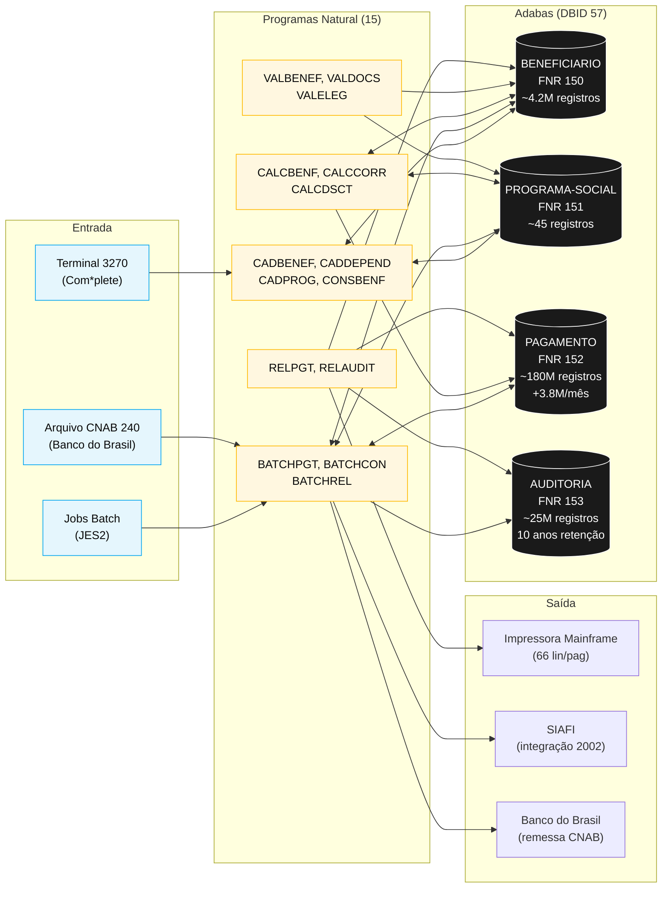

<!-- markdownlint-disable MD013 MD025 MD026 MD028 MD029 MD034 MD040 MD051 MD060 -->

# Mapa de Dependências — SIFAP Legado

  

> 🗺 **Você está aqui:** [Kit PT-BR](../README.md) → [Estágio 1](README.md) → **dependency-map**

> **Para quem é isto?** Este é um **artefato preenchido pelo time** durante o Estágio 1 (Arqueologia).
>
> **O que você terá ao final do estágio:**
>
> 1. Este documento totalmente preenchido com os dados reais do legado SIFAP
> 2. Rastreabilidade para `01-arqueologia/legado-sifap/` (programas `.NSN` e DDMs)
> 3. Base de evidência usada nas EARS do Estágio 2 (`source_legacy:`)
>
> 📘 **Guia passo a passo:** [`GUIDE.md`](GUIDE.md).

> Use diagramas Mermaid para mapear as dependências entre programas Natural e DDMs Adabas.
> O objetivo é visualizar "quem chama quem" e "quem lê/escreve o quê".

## Como descobrir dependências

- Use `grep` ou Copilot Chat para listar todas as ocorrências de `CALLNAT` nos 15 arquivos `.NSN`.
- Prompt útil: _"Liste todas as ocorrências de CALLNAT nestes arquivos e desenhe um diagrama Mermaid."_
- Para leitura/escrita em DDMs: procure por `READ`, `READ LOGICAL`, `STORE`, `UPDATE`, `DELETE`.

## Diagrama de Dependências entre Programas

> Cobertura: **15/15 programas** + **4/4 DDMs**. Construído por análise de `VIEW OF`, `FIND/READ`, `STORE/UPDATE`, `PERFORM` e `CALLNAT` em todos os arquivos `.NSN`.

```mermaid
flowchart TD
    classDef cad fill:#FFE5E5,stroke:#F25022,color:#0A0A0A
    classDef val fill:#FFF7E0,stroke:#FFB900,color:#0A0A0A
    classDef calc fill:#E5F6FD,stroke:#00A4EF,color:#0A0A0A
    classDef batch fill:#F1F8E3,stroke:#7FBA00,color:#0A0A0A
    classDef rel fill:#E8E8E8,stroke:#737373,color:#0A0A0A
    classDef cons fill:#F0E5FF,stroke:#7C3AED,color:#0A0A0A
    classDef ddm fill:#1A1A1A,stroke:#FFFFFF,color:#FFFFFF

    subgraph "Cadastro (Online)"
        CADBENEF["CADBENEF.NSN<br/>Cadastro Beneficiário"]:::cad
        CADDEPEND["CADDEPEND.NSN<br/>Cadastro Dependentes"]:::cad
        CADPROG["CADPROG.NSN<br/>Cadastro Programa"]:::cad
    end

    subgraph "Validação (Sub-rotinas)"
        VALBENEF["VALBENEF.NSN<br/>Validação Beneficiário"]:::val
        VALDOCS["VALDOCS.NSN<br/>Validação Documentos"]:::val
        VALELEG["VALELEG.NSN<br/>Validação Elegibilidade"]:::val
    end

    subgraph "Cálculo (Sub-rotinas)"
        CALCBENF["CALCBENF.NSN<br/>Cálculo Benefício"]:::calc
        CALCCORR["CALCCORR.NSN<br/>Correção Monetária IPCA"]:::calc
        CALCDSCT["CALCDSCT.NSN<br/>Cálculo Descontos"]:::calc
    end

    subgraph "Batch (Mensal/JES2)"
        BATCHPGT["BATCHPGT.NSN<br/>Geração Pagamentos"]:::batch
        BATCHCON["BATCHCON.NSN<br/>Conciliação Bancária CNAB"]:::batch
        BATCHREL["BATCHREL.NSN<br/>Relatório Consolidado"]:::batch
    end

    subgraph "Consulta Online (3270)"
        CONSBENF["CONSBENF.NSN<br/>Consulta Beneficiário"]:::cons
    end

    subgraph "Relatórios (Impressora)"
        RELPGT["RELPGT.NSN<br/>Relatório Analítico Pagamentos"]:::rel
        RELAUDIT["RELAUDIT.NSN<br/>Relatório Auditoria"]:::rel
    end

    subgraph "DDMs Adabas"
        DDM_BENEF[("BENEFICIARIO<br/>FNR 150")]:::ddm
        DDM_PROG[("PROGRAMA-SOCIAL<br/>FNR 151")]:::ddm
        DDM_PGTO[("PAGAMENTO<br/>FNR 152")]:::ddm
        DDM_AUDIT[("AUDITORIA<br/>FNR 153")]:::ddm
    end

    %% Cadastro lê/escreve ARQ 150 e 151
    CADBENEF -->|FIND/STORE/UPDATE| DDM_BENEF
    CADDEPEND -->|FIND/UPDATE PE| DDM_BENEF
    CADPROG -->|FIND/STORE| DDM_PROG

    %% Validação lê ARQ 150 (referenciado em headers mas sem CALLNAT explícito)
    VALBENEF -.->|VIEW OF| DDM_BENEF
    VALDOCS -.->|VIEW OF| DDM_BENEF
    VALELEG -->|FIND| DDM_BENEF
    VALELEG -->|FIND| DDM_PROG

    %% Cálculo lê 150+151, escreve 152
    CALCBENF -->|FIND| DDM_BENEF
    CALCBENF -->|FIND| DDM_PROG
    CALCBENF -->|STORE| DDM_PGTO
    CALCBENF -.->|PERFORM interno| DET_FAIXA[("sub: DET-FAIXA-RENDA")]
    CALCBENF -.->|PERFORM interno| CALC_DESC[("sub: CALC-DESCONTOS<br/>simplificado")]

    CALCCORR -->|READ/UPDATE| DDM_PGTO
    CALCCORR -.->|PERFORM interno| CALC_IND[("sub: CALC-INDICE-ACUM<br/>IPCA")]

    CALCDSCT -->|FIND| DDM_BENEF
    CALCDSCT -->|FIND/UPDATE| DDM_PGTO
    CALCDSCT -.->|PERFORM interno| CALC_CONTRIB[("sub: CALC-CONTRIB-SOCIAL")]

    %% Batch reimplementa lógica (não chama CALCBENF!)
    BATCHPGT -->|READ BY CPF| DDM_BENEF
    BATCHPGT -->|FIND| DDM_PROG
    BATCHPGT -->|FIND/STORE| DDM_PGTO
    BATCHPGT -.->|LÓGICA DUPLICADA<br/>de CALCBENF| CALCBENF

    BATCHCON -->|FIND/UPDATE| DDM_PGTO
    BATCHCON -->|STORE| DDM_AUDIT
    BATCHCON -.->|PERFORM| AUDIT_CONC[("sub: GRAVA-AUDITORIA-CONC")]
    BATCHCON -.->|PERFORM| AUDIT_DIV[("sub: GRAVA-AUDITORIA-DIVERG")]

    BATCHREL -->|READ BY COMP| DDM_PGTO
    BATCHREL -->|FIND| DDM_BENEF

    %% Consulta apenas lê
    CONSBENF -->|FIND| DDM_BENEF
    CONSBENF -->|READ| DDM_PGTO
    CONSBENF -.->|PERFORM interno| MASK_CPF[("sub: MASCARA-CPF<br/>⚠ inconsistente")]

    %% Relatórios apenas leem
    RELPGT -->|READ BY COMP| DDM_PGTO
    RELPGT -->|FIND| DDM_BENEF
    RELAUDIT -->|READ BY DT| DDM_AUDIT
    RELAUDIT -.->|FILTRA EX| RELAUDIT
```

> **Observações importantes do grafo:**
>
> - **Nenhum programa usa `CALLNAT`** explícito — todas as sub-rotinas são internas via `PERFORM` (mesma unidade de compilação)
> - **`BATCHPGT` não chama `CALCBENF`** — duplica a fórmula inline (BONUS-02)
> - **`VALBENEF` e `VALDOCS` não são chamados por nenhum programa** ⚠ — possíveis pontos de entrada autônomos OU código morto. Foram identificados pelos cabeçalhos como "rotina chamada antes de gravação", mas a chamada não existe no código visível.
> - **Único cross-context**: `VALELEG` é o único programa que cruza `BENEFICIARIO.ddm` (150) com `PROGRAMA-SOCIAL.ddm` (151)
> - **Hub central**: `BENEFICIARIO.ddm` é tocado por **9 dos 15 programas** (60%)

## Diagrama de Fluxo de Dados (DDMs)

## Tabela de Dependências

| Programa | Chama (PERFORM/CALLNAT) | Lê (FIND/READ) DDMs | Escreve (STORE/UPDATE) DDMs | Observações |
|---|---|---|---|---|
| `CADBENEF.NSN` | `VALIDA-CPF` (interna) | BENEFICIARIO (150) | BENEFICIARIO (150) | Inclusão/Alteração — valida CPF Módulo 11 |
| `CADDEPEND.NSN` | — | BENEFICIARIO (150) | BENEFICIARIO (150) — PE group | Adiciona dependente ao PE group do titular |
| `CADPROG.NSN` | `CONSULTA-PROG` (interna) | PROGRAMA-SOCIAL (151) | PROGRAMA-SOCIAL (151) | Inclusão + Consulta de programas |
| `VALBENEF.NSN` | `VALIDA-CPF-COMPLETO`, `VALIDA-DATA`, `VALIDA-NOME` (todas internas) | BENEFICIARIO (VIEW) | — | ⚠ Não é chamado por ninguém visivelmente |
| `VALDOCS.NSN` | `VALIDA-CPF-DOC`, `VALIDA-RG`, `CHECK-DOC-ESPECIAL` (internas) | BENEFICIARIO (VIEW) | — | ⚠ Não é chamado por ninguém visivelmente |
| `VALELEG.NSN` | — | BENEFICIARIO (150), PROGRAMA-SOCIAL (151) | — | **Único programa que cruza 150+151** |
| `CALCBENF.NSN` | `DET-FAIXA-RENDA`, `CALC-DESCONTOS` (internas) | BENEFICIARIO (150), PROGRAMA-SOCIAL (151) | PAGAMENTO (152) | Cálculo principal — fórmula 5 fatores |
| `CALCCORR.NSN` | `CALC-INDICE-ACUM` (interna) | PAGAMENTO (152) | PAGAMENTO (152) | Correção monetária retroativa IPCA |
| `CALCDSCT.NSN` | `CALC-CONTRIB-SOCIAL` (interna) | BENEFICIARIO (150), PAGAMENTO (152) | PAGAMENTO (152) | Calcula descontos com teto 30% |
| `BATCHPGT.NSN` | — (duplica lógica de CALCBENF) | BENEFICIARIO (150), PROGRAMA-SOCIAL (151), PAGAMENTO (152) | PAGAMENTO (152) | Batch mensal — gera ~3.8M pagamentos/mês |
| `BATCHCON.NSN` | `GRAVA-AUDITORIA-CONC`, `GRAVA-AUDITORIA-DIVERG` (internas) | PAGAMENTO (152) | PAGAMENTO (152), AUDITORIA (153) | Conciliação CNAB 240 + auditoria |
| `BATCHREL.NSN` | `IMPRIME-CABECALHO` (interna) | PAGAMENTO (152), BENEFICIARIO (150) | — | Consolidado mensal — half-up rounding |
| `CONSBENF.NSN` | `MASCARA-CPF` (interna ⚠ inconsistente) | BENEFICIARIO (150), PAGAMENTO (152) | — | Tela 3270 (MAP `CONSBENF-M01`) |
| `RELPGT.NSN` | `IMPRIME-CABECALHO`, `IMPRIME-SUBTOTAL` (internas) | PAGAMENTO (152), BENEFICIARIO (150) | — | Relatório impressora 66 lin/pag |
| `RELAUDIT.NSN` | `IMPRIME-CAB-AUDIT` (interna) | AUDITORIA (153) | — | ⚠ Filtra ação `EX` silenciosamente (MYS-010) |

## Matriz Programa × DDM

| Programa | BENEFICIARIO (150) | PROGRAMA-SOCIAL (151) | PAGAMENTO (152) | AUDITORIA (153) |
|---|---|---|---|---|
| CADBENEF | R/W | — | — | — |
| CADDEPEND | R/W | — | — | — |
| CADPROG | — | R/W | — | — |
| VALBENEF | R (VIEW) | — | — | — |
| VALDOCS | R (VIEW) | — | — | — |
| VALELEG | R | R | — | — |
| CALCBENF | R | R | W | — |
| CALCCORR | — | — | R/W | — |
| CALCDSCT | R | — | R/W | — |
| BATCHPGT | R | R | R/W | — |
| BATCHCON | — | — | R/W | W |
| BATCHREL | R | — | R | — |
| CONSBENF | R | — | R | — |
| RELPGT | R | — | R | — |
| RELAUDIT | — | — | — | R (com filtro) |
| **Total leitores** | **11** | **5** | **9** | **1** |
| **Total escritores** | **4** | **2** | **7** | **1** |

> **Insight**: `BENEFICIARIO` é o DDM mais acessado (11 leitores, 4 escritores) — bottleneck arquitetural. Na migração, deve ser o primeiro bounded context isolado.

## Dependências Circulares

Nenhuma dependência circular detectada nos 15 programas.

- Não há `CALLNAT` entre programas do mesmo módulo
- Sub-rotinas internas (`PERFORM`) não saem do escopo do próprio programa
- O risco potencial é **divergência semântica** (BATCHPGT vs CALCBENF) e não acoplamento circular

## Programas Órfãos

Programas que não são chamados por nenhum outro (possíveis pontos de entrada autônomos OU código morto):

| Programa | Tipo | Comentário |
|---|---|---|
| `VALBENEF.NSN` | ⚠ Órfão suspeito | Cabeçalho diz "rotina chamada antes de gravação" mas nenhum `CALLNAT VALBENEF` encontrado em CADBENEF |
| `VALDOCS.NSN` | ⚠ Órfão suspeito | Mesmo padrão — não há `CALLNAT VALDOCS` |
| `VALELEG.NSN` | Ponto de entrada | Provável invocação por job batch separado ou tela 3270 não capturada nos arquivos |
| `CALCCORR.NSN` | Ponto de entrada | Job batch trimestral/anual de correção retroativa |
| `CALCDSCT.NSN` | Ponto de entrada | Pode ser chamado por trigger ou job avulso |
| `CADBENEF.NSN` / `CADDEPEND.NSN` / `CADPROG.NSN` | Pontos de entrada online | Telas 3270 |
| `CONSBENF.NSN` | Ponto de entrada online | Tela MAP `CONSBENF-M01` |
| `BATCHPGT.NSN` / `BATCHCON.NSN` / `BATCHREL.NSN` | Pontos de entrada batch | Jobs JES2 mensais |
| `RELPGT.NSN` / `RELAUDIT.NSN` | Pontos de entrada batch | Jobs JES2 sob demanda |

> **Investigação recomendada**: confirmar com SENARC se VALBENEF e VALDOCS são chamados por algum sistema externo, ou se são código morto (foram substituídos por validação inline em CADBENEF).

---

### Continuar a leitura

<table width="100%">
<tr>
<td width="50%" valign="top" align="left">
<strong>← ANTERIOR</strong> 
<a href="business-rules-catalog.md"><strong>business-rules-catalog.md</strong></a> 
Catálogo de regras.
</td>
<td width="50%" valign="top" align="right">
<strong>PRÓXIMO →</strong> 
<a href="discovery-report.md"><strong>discovery-report.md</strong></a> 
Síntese final.
</td>
</tr>
</table>

↑ <a href="README.md">Voltar ao Kit PT-BR</a>

