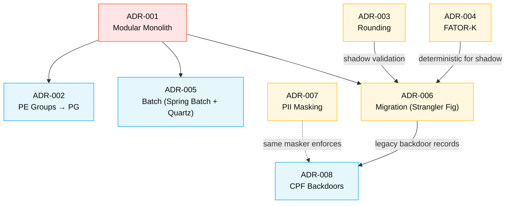

<!-- markdownlint-disable MD013 MD025 MD026 MD028 MD029 MD034 MD040 MD051 MD060 -->

# ADR Index — SIFAP 2.0

  

> 🗺 **Você está aqui:** [Kit PT-BR](../../README.md) → [Estágio 2](../README.md) → **ADRs Index**

> **What is an ADR?** An Architectural Decision Record captures a significant decision, the context that demanded it, the options considered, the choice made, and the consequences accepted. ADRs are how teams remember **why** the system looks the way it does — long after the people who decided are gone.
>
> **Format**: All SIFAP 2.0 ADRs follow MADR (Markdown Architectural Decision Records) with extensions: deciders, decision drivers, ≥3 options with honest pros/cons, validation steps.

## Status Legend

| Badge | Meaning |
|---|---|
|  | Decision is in effect; code/infra reflects it |
|  | Draft pending review |
|  | Replaced by a newer ADR (see header for reference) |
|  | No longer applies but kept for history |

## Severity Legend

| Badge | Impact |
|---|---|
|  | Drives all other decisions |
|  | Financial, security, or compliance impact |
|  | Significant operational or design impact |
|  | Localized impact |

## Decision Catalog

| # | Title | Status | Severity | Resolves |
|---|---|---|---|---|
| [ADR-001](ADR-001-modular-monolith.md) | Adopt Modular Monolith over Microservices | ✅ Accepted | Foundational | CON-002, sets shape for all other ADRs |
| [ADR-002](ADR-002-pe-groups-mapping.md) | Map Adabas PE Groups to PostgreSQL Child Tables (with JSONB Exception) | ✅ Accepted | High | FR-BEN-005, FR-PROG-001, BR-006 (PE groups) |
| [ADR-003](ADR-003-financial-rounding.md) | Financial Rounding Policy — Half-Even with Legacy Compatibility Flag | ✅ Accepted | Critical | MYS-005, INC-004, BR-020, BR-021 |
| [ADR-004](ADR-004-fator-k-handling.md) | FATOR-K Handling — Parameter Table with Audit, Not a Magic Constant | ✅ Accepted | Critical | MYS-003, BR-010 |
| [ADR-005](ADR-005-batch-orchestration.md) | Batch Orchestration — Spring Batch + Quartz Inside the Monolith | ✅ Accepted | High | FR-PAY-012, FR-PAY-015, NFR-PERF-003 |
| [ADR-006](ADR-006-data-migration-strategy.md) | Data Migration Strategy — Strangler Fig with Read-Through Cutover | ✅ Accepted | Critical | OUT-008, NFR-AVAIL-001, NFR-COMP-002 |
| [ADR-007](ADR-007-pii-masking-policy.md) | PII Masking Policy — Mask Central Groups, Reveal Last Two Digits | ✅ Accepted | Critical | BONUS-03, BONUS-04, BR-040, BR-041, NFR-COMP-001 |
| [ADR-008](ADR-008-cpf-test-backdoors.md) | CPF Test Backdoors — Disabled in Production via Feature Flag | ✅ Accepted | High | MYS-007, EGG-002, BR-028, BR-029, NFR-SEC-004 |

## Decision Dependencies

## Decisions by Stage 1 Finding

Cross-reference: every Stage 1 finding ends up addressed somewhere.

| Stage 1 Finding | Resolved by |
|---|---|
| MYS-001 (status `S` auto for >75y) | FR-BEN-010 + FR-BEN-011 (no ADR — handled in domain model) |
| MYS-002 (dependents 3/5/10 mismatch) | FR-BEN-005 + ADR-002 (config in `social_program`) |
| MYS-003 (FATOR-K magic constant) | **ADR-004** |
| MYS-004 (December formula) | FR-PAY-006, FR-PAY-007 (no ADR — domain logic) |
| MYS-005 (truncation loss) | **ADR-003** |
| MYS-006 (Judicial bypasses 30% cap) | FR-PAY-009 (preserved — legal exception) |
| MYS-007 (8 CPF prefix backdoor) | **ADR-008** |
| MYS-008 (region 99 bypass) | FR-PROG-006 (`SpecialRegion` explicit model) |
| MYS-009 (batch CPF ordering) | FR-PAY-014 + ADR-005 (Spring Batch partition by CPF) |
| MYS-010 (`EX` action hidden) | FR-AUD-002 (show all actions, default-no-filter) |
| EGG-001 (Plano Verão dead code) | OUT-003 (removed) |
| EGG-002 (test CPF backdoor) | **ADR-008** |
| EGG-003 (Banco Real dead code) | OUT-004 (removed) |
| INC-001 (dependent count mismatch) | FR-BEN-005 (parameterized) |
| INC-002 (manual missing AUDIT DDM) | Documentation gap — addressed in C4 L2 (next deliverable) |
| INC-003 (calc rules undocumented) | All ADRs + this catalog provide documentation |
| INC-004 (two rounding methods) | **ADR-003** |
| BONUS-01 (status `S` semantic conflict) | FR-BEN-010 (`LifecycleStatus` + `AgeCategory`) |
| BONUS-02 (CALCBENF/BATCHPGT duplication) | FR-PAY-018 + NFR-MAIN-003 (single `PaymentCalculatorService`) |
| BONUS-03 (CPF mask leak in CONSBENF) | **ADR-007** |
| BONUS-04 (CPF mask leak in RELPGT) | **ADR-007** |
| BONUS-05 (RELAUDIT EX hide documented in DDM) | FR-AUD-002 |
| BONUS-06 (CO actions not logged since 2010) | NFR-COMP-002 (10-year retention restored) |
| BONUS-07 (FATOR-K marked NÃO DOCUMENTADO in DDM) | **ADR-004** |

**Coverage**: 24/24 Stage 1 findings explicitly addressed in FR, NFR, or ADR.

## Decisions by Bounded Context

| Context | ADRs that directly apply |
|---|---|
| **BeneficiaryManagement** | ADR-001, ADR-002, ADR-007, ADR-008 |
| **SocialProgramRegistry** | ADR-001, ADR-002, ADR-004 |
| **PaymentProcessing** | ADR-001, ADR-003, ADR-005 (most ADRs land here) |
| **ReportingAndAudit** | ADR-001, ADR-003 (rounding eliminates INC-004), ADR-007 |
| **Cross-cutting (migration, deployment)** | ADR-001, ADR-005, ADR-006 |

## How to add a new ADR

1. Copy [`templates/ADR.template.md`](../templates/ADR.template.md) to `02-spec-moderna/ADR-NNN-<short-kebab-name>.md` where NNN is the next sequential number
2. Fill in: Status, Deciders, Technical Story, Context, Decision Drivers, ≥3 Considered Options with pros/cons, Decision Outcome, Consequences (positive AND negative), Validation, Related Requirements, References
3. Add an entry to this index table
4. Open PR with the title `adr: ADR-NNN <short description>`
5. PR must be reviewed by ≥1 person from Par 2 (Architecture) and ≥1 person from the affected pair
6. Update `requirements.md` if the ADR changes any FR/NFR

## When to update an existing ADR

ADRs are immutable for the **decision**, mutable for **clarifications**:

- **DO update** the validation section if new tests are added
- **DO update** the references section if new sources appear
- **DO NOT change** the decision — instead, create a new ADR with status `Superseded by ADR-XXX` on the old one

## Pending ADRs (potential future)

These came up in Stage 2 discussions but are **not yet required**. Listed for visibility:

- **ADR-009 (potential)**: Authentication & Identity Provider — Entra ID vs Keycloak vs Okta
- **ADR-010 (potential)**: Frontend State Management Boundary — when to use Zustand vs Server Components only
- **ADR-011 (potential)**: API Versioning Strategy — URI path vs Accept-header vs schema-driven
- **ADR-012 (potential)**: Tenancy Model — multi-tenant vs single-tenant if SIFAP federalization expands

These will be written when their decisions actually need to be made — premature ADRs are noise.

---

## Referências

- [`templates/ADR.template.md`](../templates/ADR.template.md) — MADR template
- [`techstack.md`](techstack.md) — tech stack contract (where decisions originate)
- [`requirements.md`](requirements.md) — FRs and NFRs that ADRs serve
- [MADR — Markdown Architectural Decision Records](https://adr.github.io/madr/)
- Michael Nygard, [Documenting Architecture Decisions](https://cognitect.com/blog/2011/11/15/documenting-architecture-decisions) — the original ADR essay
- [ADR GitHub organization](https://adr.github.io/) — community templates

---
