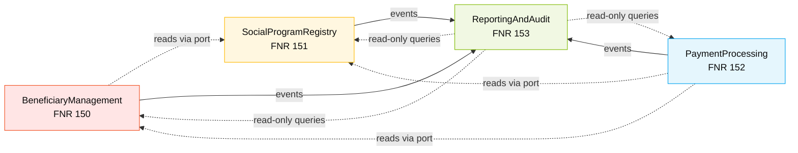

<!-- markdownlint-disable MD013 MD025 MD026 MD028 MD029 MD034 MD040 MD051 MD060 -->

# Bounded Contexts — SIFAP 2.0

  

> 🗺 **Você está aqui:** [Kit PT-BR](../../README.md) → [Estágio 2](../README.md) → [Baseline](README.md) → **Bounded Contexts**

> **Status**: Accepted on 2026-05-20. Refines the 4 contexts proposed in `discovery-report.final.md` §7 using DDD criteria (cohesion, coupling, change frequency). Input for `/speckit.specify` and C4 L2 diagrams.

## Carving criteria applied

For each candidate context we evaluated three DDD criteria:

| Criterion | What we checked |
|---|---|
| **Cohesion** | Do the operations share the same business vocabulary and rules? |
| **Coupling** | How many cross-context dependencies does this context need? |
| **Change frequency** | Do these capabilities tend to change together over time? |

A candidate becomes a context only when **all three** point in the same direction.

## Hypotheses evaluated

### Hypothesis A — `BeneficiaryManagement` — ✅ ACCEPTED

| Criterion | Assessment | Evidence |
|---|---|---|
| Cohesion | High | All operations work on a single aggregate root (`Beneficiary`) and its children (`Dependent`, `Discount`). Shared vocabulary: CPF, NIS, status, eligibility. |
| Coupling | Low | Reads `SocialProgram` only for FK validation (CON-010); does not depend on payment or audit logic. |
| Change frequency | Aligned | CADBENEF, CADDEPEND, VALBENEF, VALDOCS evolved together in the legacy (same authors, similar revision dates). |

### Hypothesis B — `SocialProgramRegistry` — ✅ ACCEPTED

| Criterion | Assessment | Evidence |
|---|---|---|
| Cohesion | High | All operations manage the catalog of social programs and their parameters (`FATOR-K`, calculation bands, regional params, eligibility criteria). |
| Coupling | Low | Read by everyone, written by no one else. |
| Change frequency | Aligned | CADPROG and VALELEG modifications historically coincided with policy changes (SENARC), distinct cadence from beneficiary management. |

### Hypothesis C — `PaymentProcessing` — ✅ ACCEPTED

| Criterion | Assessment | Evidence |
|---|---|---|
| Cohesion | Very high | All operations produce or transform a `Payment` aggregate (BATCHPGT, CALCBENF, CALCDSCT, CALCCORR, BATCHCON). Same core formula (BR-017). |
| Coupling | Medium | Reads `Beneficiary` and `SocialProgram` (necessary for calculation); writes to `AuditEvent` (necessary for compliance). Cross-context interactions are stable and well-defined. |
| Change frequency | Aligned | Cálculo + batch + conciliação cluster: BATCHPGT alone had 5 revisions over 18 years tracking the same domain (13º, abono, faixas, auditoria). |

### Hypothesis D — `ReportingAndAudit` — ✅ ACCEPTED

| Criterion | Assessment | Evidence |
|---|---|---|
| Cohesion | High | All operations are read-only over the audit trail and aggregated payment data (RELAUDIT, RELPGT, BATCHREL, CONSBENF). |
| Coupling | Read-only | Reads from all other contexts but writes nothing (except its own audit event log via `BatchCon`). Cross-context reads are explicit. |
| Change frequency | Aligned | Reports change when compliance requirements change (TCU, IN-TCU 63/2010) — distinct cadence from operational contexts. |

### Hypothesis E — `Notification` — ❌ REJECTED

| Criterion | Assessment | Evidence |
|---|---|---|
| Cohesion | Low | No coherent set of operations exists yet — the legacy has zero notification logic (sessions on terminals don't notify). |
| Coupling | N/A | Would need to listen to events from every other context. |
| Change frequency | Unknown | Greenfield — no evolutionary evidence. |

**Decision**: defer to a future workshop iteration. Until SENARC defines what notifications matter, creating a Notification context is premature.

### Hypothesis F — `Identity / Authentication` — ❌ REJECTED (as separate context)

| Criterion | Assessment | Evidence |
|---|---|---|
| Cohesion | Medium | OAuth 2.0 + JWT + RBAC is coherent. |
| Coupling | Very high | Every other context depends on it for every request. |
| Change frequency | Low | Auth doesn't evolve with business — it's infrastructure. |

**Decision**: handle as **cross-cutting infrastructure** (Spring Security configuration shared across the monolith), not as a bounded context. Documented in NFR-SEC and FR-AUTH-* requirements.

## Final Bounded Contexts (4)

### 1. BeneficiaryManagement

- **Responsibility**: registration, validation, and lifecycle of beneficiaries and their dependents
- **Owned data**: `beneficiary` table (+ `dependent`, `beneficiary_discount` child tables), Adabas FNR 150
- **Public interface**:
  - REST: `POST/GET/PUT/DELETE /api/v1/beneficiaries[/{cpf}]`, `POST /api/v1/beneficiaries/{cpf}/dependents`
  - Domain events published: `BeneficiaryRegistered`, `BeneficiaryStatusChanged`, `DependentAdded`, `DependentRemoved`
  - Domain events consumed: none (entry-of-record context)
- **Why it's its own context**: owns the canonical Beneficiary aggregate. Validation logic (Mod-11 CPF, Mod-11 alternates, age category, life-cycle status) clusters here. Changes are driven by registration policy, not by payment or report needs.
- **Stage 1 evidence**: CADBENEF, CADDEPEND, VALBENEF, VALDOCS (all share `BENEFICIARIO.ddm` FNR 150)
- **Maps to**: FR-BEN-001 to FR-BEN-013, ADR-002 (PE groups), ADR-007 (PII), ADR-008 (CPF backdoors)

### 2. SocialProgramRegistry

- **Responsibility**: catalog of social programs, eligibility criteria, calculation parameters (`FATOR-K`, regional factors, calculation bands)
- **Owned data**: `social_program` table (+ JSONB columns for `calculation_bands`, `regional_params`), Adabas FNR 151
- **Public interface**:
  - REST: `POST/GET/PUT /api/v1/social-programs[/{code}]`, `GET /api/v1/social-programs/{code}/eligibility/{beneficiary_cpf}`
  - Domain events published: `SocialProgramCreated`, `SocialProgramParameterChanged`, `FatorKChanged`
  - Domain events consumed: none
- **Why it's its own context**: owns the program-as-a-product concept. Has a distinct stakeholder (SENARC policy team) with a different change cadence (regulatory) from operational changes (beneficiary management, payment).
- **Stage 1 evidence**: CADPROG, VALELEG (share `PROGRAMA-SOCIAL.ddm` FNR 151)
- **Maps to**: FR-PROG-001 to FR-PROG-006, ADR-004 (FATOR-K)

### 3. PaymentProcessing

- **Responsibility**: payment calculation (mensal, 13º, abono, descontos), batch generation, bank reconciliation (CNAB 240)
- **Owned data**: `payment` table (partitioned by hash of CPF, 16 partitions), Adabas FNR 152
- **Public interface**:
  - REST: `POST /api/v1/payments/calculate/{cpf}/{competence}`, `GET /api/v1/payments?cpf=...`, `POST /api/v1/batches/payments/run`, `POST /api/v1/batches/conciliation/upload-cnab`
  - Domain events published: `PaymentGenerated`, `PaymentReconciled`, `PaymentDivergenceDetected`, `BatchStarted`, `BatchCompleted`, `BatchFailed`
  - Domain events consumed: `BeneficiaryStatusChanged` (recalculate eligibility on status change), `SocialProgramParameterChanged` (recalculate going forward)
- **Why it's its own context**: financial core. Encapsulates the formula (BR-017), the seasonal rules (December — MYS-004), the rounding policy (ADR-003), and the batch lifecycle. Largest blast radius in the system — must be isolated.
- **Stage 1 evidence**: BATCHPGT, CALCBENF, CALCCORR, CALCDSCT, BATCHCON (share `PAGAMENTO.ddm` FNR 152)
- **Maps to**: FR-PAY-001 to FR-PAY-019, ADR-003 (rounding), ADR-005 (batch orchestration)

### 4. ReportingAndAudit

- **Responsibility**: audit trail (write), read-only reports (payment analytics, audit reports, beneficiary queries)
- **Owned data**: `audit_event` table (write-only, immutable), Adabas FNR 153. **Reads** from all other contexts via repository facades.
- **Public interface**:
  - REST: `GET /api/v1/audit/events?...`, `GET /api/v1/reports/payments?...`, `GET /api/v1/reports/audit?...`, `GET /api/v1/beneficiaries/search?...`
  - Domain events published: `AuditEventRecorded`
  - Domain events consumed: ALL events from other contexts → translated into `audit_event` rows
- **Why it's its own context**: distinct read-only access pattern (reports + queries), distinct compliance concerns (10-year retention, IN-TCU 63/2010), distinct stakeholder (auditors, regulators). Crucially: this context **fixes** MYS-010 by removing the silent `EX` filter (FR-AUD-002).
- **Stage 1 evidence**: BATCHREL, RELPGT, RELAUDIT, CONSBENF (read-mostly programs across all DDMs, plus `AUDITORIA.ddm` FNR 153)
- **Maps to**: FR-AUD-001 to FR-AUD-007, NFR-COMP-001 to NFR-COMP-005

## Cross-context communication

### Allowed mechanisms

| Mechanism | When to use | Example |
|---|---|---|
| **Domain events** (Spring Application Events, in-process) | Async notifications; one context observes another | `PaymentProcessing` publishes `PaymentGenerated` → `ReportingAndAudit` records `audit_event` |
| **Published repository interface** | Read-only access to another context's data | `PaymentProcessing` reads `BeneficiaryQueryPort.findActiveBeneficiary(cpf)` to know program assignment |
| **REST API (same monolith, internal)** | Discouraged — prefer events or interface | Only for legitimate user-facing flows that cross contexts |

### Forbidden mechanisms

| Mechanism | Why forbidden |
|---|---|
| Direct JPA entity sharing | Couples contexts at the persistence layer — defeats the whole point of bounded contexts |
| Reading another context's table directly via SQL/Repository | Bypasses the published interface — discovered by ArchUnit test |
| Synchronous cross-context call inside a transaction | Risks deadlock; couples failure modes |

### Communication matrix

| From ↓ / To → | Beneficiary | SocialProgram | Payment | Audit |
|---|---|---|---|---|
| **Beneficiary** | — | reads (query) | publishes events | publishes events |
| **SocialProgram** | — | — | publishes events | publishes events |
| **Payment** | reads (query) | reads (query) | — | publishes events |
| **Audit** | reads (report) | reads (report) | reads (report) | — |



## Bounded context boundaries — enforcement

Each context is a top-level Java package:

```text
com.sifap
├── beneficiary          ← BeneficiaryManagement
│   ├── domain
│   ├── application
│   ├── infrastructure
│   └── api
├── socialprogram        ← SocialProgramRegistry
├── payment              ← PaymentProcessing
├── reporting            ← ReportingAndAudit
└── shared               ← cross-cutting (security, audit base, time)
```

### ArchUnit rules

```java
@ArchTest
static final ArchRule contexts_must_not_depend_on_each_other_directly =
    noClasses().that().resideInAPackage("..beneficiary..")
        .should().dependOnClassesThat().resideInAnyPackage(
            "..payment..", "..socialprogram..", "..reporting..");

@ArchTest
static final ArchRule cross_context_reads_only_via_ports =
    classes().that().resideInAPackage("..payment.application..")
        .should().onlyDependOnClassesThat().resideInAnyPackage(
            "..payment..", "..shared..",
            "..beneficiary.api..",         // ports only
            "..socialprogram.api..");

@ArchTest
static final ArchRule audit_can_read_but_not_write_other_contexts =
    noClasses().that().resideInAPackage("..reporting..")
        .should().callMethodWhere(target ->
            target.getName().startsWith("save") ||
            target.getName().startsWith("delete") ||
            target.getName().startsWith("update"))
        .andTargetClass(belongsTo("..beneficiary..", "..socialprogram..", "..payment.."));
```

### Migration order to PostgreSQL (ADR-006)

Bounded context migration follows dependency order — least coupled first:

1. **SocialProgramRegistry** (low write volume, ~45 rows; safe to start)
2. **BeneficiaryManagement** (4.2M rows; high read volume, manageable risk)
3. **ReportingAndAudit** (read-only initially; cuts over once #1 + #2 are stable)
4. **PaymentProcessing** (highest blast radius; cuts over last after 3 full payment cycles validated)

## Validation

- ✅ Each context has a single root aggregate identifiable in the domain (Beneficiary, SocialProgram, Payment, AuditEvent)
- ✅ Each context owns a distinct Adabas FNR (150, 151, 152, 153) — no shared physical storage in the legacy
- ✅ Each context maps to a distinct cluster of Stage 1 programs by prefix and revision history
- ✅ ArchUnit rules above are testable and will be part of the CI gate
- ✅ Each context owns its own Flyway migration folder (`db/migration/{beneficiary,socialprogram,payment,reporting}/`)
- ✅ Cross-context reads happen via `*.api` packages only — enforced by ArchUnit
- ✅ Mermaid renders correctly (4 nodes + edges visible in any markdown renderer)

## What this enables for `/speckit.specify`

When generating specs, the bounded context is the **scoping unit**:

```text
/speckit.specify Beneficiary Registration. Bounded context: BeneficiaryManagement
(see 02-spec-moderna/baseline/bounded-contexts.md §1). Owned data: beneficiary,
dependent, beneficiary_discount. Cross-context dependencies: read-only on
SocialProgram via BeneficiaryQueryPort. Domain events to publish:
BeneficiaryRegistered, DependentAdded.
```

The spec generator now has clear boundaries: what data the spec can write, what data it must read via a port, what events to publish.

## Related artifacts

- [`requirements.md`](requirements.md) — FRs organized by these 4 contexts (sections 2.1 to 2.4)
- [`ADR-001-modular-monolith.md`](ADR-001-modular-monolith.md) — why these are package boundaries, not service boundaries
- [`ADR-002-pe-groups-mapping.md`](ADR-002-pe-groups-mapping.md) — how each context handles PE groups
- [`../../01-arqueologia/output-requisitos/dependency-map.md`](../../01-arqueologia/dependency-map.md) — Stage 1 dependency graph that supports this carving
- [`../../01-arqueologia/output-requisitos/discovery-report.final.md`](../../01-arqueologia/output-requisitos/discovery-report.final.md) §7 — initial proposal refined here

---

## Referências

- Eric Evans, *Domain-Driven Design* (2003) — original Bounded Context concept
- Vaughn Vernon, *Implementing Domain-Driven Design* (2013) — Context Mapping patterns
- [DDD Reference — Bounded Context](https://www.domainlanguage.com/ddd/reference/) — Evans's reference card
- [`modular-monolith.instructions.md`](../../.github/instructions/modular-monolith.instructions.md) — package-by-feature rules enforced by ArchUnit

---

