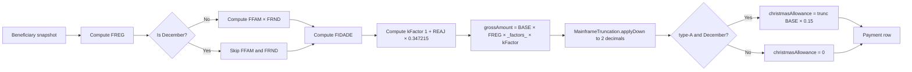

# Implementation Plan: Monthly Payment Cycle Generation

**Feature Branch**: `001-payment-cycle-generation`
**Spec**: [`spec.md`](spec.md)
**Created**: 2026-05-20
**Status**: Draft

> Honors [`baseline/techstack.md`](../../02-spec-moderna/baseline/techstack.md), [`baseline/bounded-contexts.md`](../../02-spec-moderna/baseline/bounded-contexts.md) §4 (`PaymentProcessing`), and the constitution `.specify/memory/constitution.md` v1.0.0.

## 1. Module Layout (package-by-feature, ADR-001)

```text
backend/src/main/java/com/sifap/paymentprocessing/
├── domain/
│   ├── PaymentCycle.java                     ← aggregate root
│   ├── Payment.java                          ← child entity
│   ├── CycleFailure.java
│   ├── CycleSkip.java
│   ├── CycleStatus.java                      ← enum
│   ├── PaymentStatus.java                    ← enum
│   ├── PaymentType.java                      ← enum (MONTHLY, THIRTEENTH)
│   ├── SkipReason.java                       ← enum
│   ├── Money.java                            ← BigDecimal-backed value object, DOWN rounding
│   ├── Competence.java                       ← YearMonth wrapper with validation
│   └── calculation/
│       ├── PaymentFormula.java               ← orchestrates BR-017/018
│       ├── RegionalFactor.java               ← BR-012, 27-UF table
│       ├── FamilyFactor.java                 ← BR-014
│       ├── IncomeFactor.java                 ← BR-015
│       ├── AgeFactor.java                    ← BR-016
│       ├── KFactor.java                      ← BR-010, MYS-003 constant 0.347215
│       ├── ChristmasAllowance.java           ← BR-019
│       └── MainframeTruncation.java          ← BR-020, RoundingMode.DOWN
│   └── events/
│       ├── PaymentCycleStarted.java
│       ├── PaymentGenerated.java
│       ├── PaymentCycleCompleted.java
│       ├── PaymentCycleAborted.java
│       ├── RegionBypassUsed.java             ← BR-024, MYS-008 — emitted per region-99 row
│       └── BeneficiarySkipped.java
├── application/
│   ├── PaymentCycleService.java              ← starts/cancels cycles
│   ├── PaymentCycleQueryService.java
│   ├── PaymentCycleScheduler.java            ← Quartz job, gated by feature flag
│   └── ports/
│       ├── BeneficiarySnapshotPort.java      ← reads from BeneficiaryManagement.api
│       ├── SocialProgramQueryPort.java       ← reads from SocialProgramRegistry.api
│       └── AuditEventPublisher.java          ← writes to ReportingAndAudit
├── infrastructure/
│   ├── batch/
│   │   ├── PaymentCycleJobConfig.java        ← Spring Batch job definition (ADR-005)
│   │   ├── BeneficiaryItemReader.java        ← chunked, sorted-by-CPF JDBC cursor
│   │   ├── PaymentItemProcessor.java         ← runs PaymentFormula, emits skip/failure
│   │   ├── PaymentItemWriter.java            ← bulk insert with batch size 1000
│   │   └── PaymentCycleStepListener.java     ← progress events every 10s
│   ├── persistence/
│   │   ├── PaymentCycleRepository.java
│   │   ├── PaymentRepository.java
│   │   ├── CycleFailureRepository.java
│   │   └── CycleSkipRepository.java
│   ├── scheduler/
│   │   └── QuartzCycleScheduler.java
│   ├── csv/
│   │   └── PaymentCycleCsvExporter.java      ← FR-027
│   └── config/
│       ├── PaymentProcessingModuleConfig.java
│       └── CycleSchedulerBootGuard.java      ← refuses prod auto-trigger without SENARC flag
├── api/                                      ← published port (read-only for other contexts)
│   └── PaymentCycleQueryPort.java
└── interfaces/
    ├── PaymentCycleController.java
    └── dto/
        ├── TriggerCycleRequest.java
        ├── CancelCycleRequest.java
        ├── PaymentCycleDto.java
        ├── PaymentCycleSummaryDto.java
        └── CycleFailureDto.java
```

**ArchUnit rules** (`PaymentProcessingArchitectureTest`):

- `..paymentprocessing.application..` may only depend on `..paymentprocessing..` + `..shared..` + `..beneficiary.api..` + `..socialprogram.api..`.
- `..paymentprocessing.domain..` must not import any persistence framework.
- The class `MainframeTruncation` is the **only** allowed place where `RoundingMode.DOWN` appears (a guarding rule that fails the build if anyone tries half-up).
- No class outside `..paymentprocessing..` imports `Payment.class` or `PaymentCycle.class` directly — they go through `PaymentCycleQueryPort`.

## 2. Database Schema (Flyway, partitioned for scale)

Migration folder: `backend/src/main/resources/db/migration/payment/`

### V001__payment_cycle_init.sql

```sql
CREATE TABLE payment_cycle (
    id                       BIGSERIAL PRIMARY KEY,
    competence               CHAR(7)         NOT NULL,                -- 'YYYY-MM'
    program_code             CHAR(4)         NOT NULL,
    status                   VARCHAR(15)     NOT NULL DEFAULT 'Pending',
    triggered_by             VARCHAR(64)     NOT NULL,
    correlation_id           UUID            NOT NULL,
    started_at               TIMESTAMPTZ     NULL,
    completed_at             TIMESTAMPTZ     NULL,
    generated_count          BIGINT          NOT NULL DEFAULT 0,
    skipped_count            BIGINT          NOT NULL DEFAULT 0,
    error_count              BIGINT          NOT NULL DEFAULT 0,
    region99_bypass_count    BIGINT          NOT NULL DEFAULT 0,
    total_gross_amount       NUMERIC(18,2)   NOT NULL DEFAULT 0,
    snapshot_at              TIMESTAMPTZ     NULL,                    -- snapshot consistency
    force_backfill           BOOLEAN         NOT NULL DEFAULT false,
    backfill_reason          TEXT            NULL,
    created_at               TIMESTAMPTZ     NOT NULL DEFAULT now(),
    version                  BIGINT          NOT NULL DEFAULT 0,
    CONSTRAINT chk_status    CHECK (status IN ('Pending','Running','Completed','Aborted','Stale')),
    CONSTRAINT chk_competence CHECK (competence ~ '^[0-9]{4}-(0[1-9]|1[0-2])$'),
    CONSTRAINT uq_cycle      UNIQUE (competence, program_code)        -- BR-034 idempotency
);

CREATE INDEX idx_payment_cycle_status ON payment_cycle (status)
    WHERE status IN ('Pending','Running','Stale');

-- payment is the high-volume table → partitioned by competence
CREATE TABLE payment (
    id                       BIGSERIAL,
    cycle_id                 BIGINT          NOT NULL REFERENCES payment_cycle(id),
    beneficiary_id           BIGINT          NOT NULL,
    cpf                      CHAR(11)        NOT NULL,
    competence               CHAR(7)         NOT NULL,
    program_code             CHAR(4)         NOT NULL,
    payment_type             VARCHAR(10)     NOT NULL,                 -- MONTHLY / THIRTEENTH
    gross_amount             NUMERIC(15,2)   NOT NULL,
    christmas_allowance      NUMERIC(15,2)   NOT NULL DEFAULT 0,
    status                   VARCHAR(10)     NOT NULL DEFAULT 'Pending',
    factors                  JSONB           NOT NULL,                 -- {FREG, FFAM, FRND, FIDADE, kFactor, base}
    region_code              SMALLINT        NOT NULL,
    region_bypass            BOOLEAN         NOT NULL DEFAULT false,   -- true when region=99
    generated_at             TIMESTAMPTZ     NOT NULL DEFAULT now(),
    voided_at                TIMESTAMPTZ     NULL,
    PRIMARY KEY (id, competence),
    CONSTRAINT chk_pay_type  CHECK (payment_type IN ('MONTHLY','THIRTEENTH')),
    CONSTRAINT chk_pay_status CHECK (status IN ('Pending','Released','Paid','Voided'))
) PARTITION BY RANGE (competence);

-- Partitions are created by a separate maintenance job; seed two:
CREATE TABLE payment_2026 PARTITION OF payment
    FOR VALUES FROM ('2026-01') TO ('2027-01');
CREATE TABLE payment_2027 PARTITION OF payment
    FOR VALUES FROM ('2027-01') TO ('2028-01');

-- Idempotency at row level (BR-034 defense in depth)
CREATE UNIQUE INDEX uq_payment_per_competence ON payment (cpf, competence, program_code);

-- Driving access pattern: list payments per beneficiary, newest first
CREATE INDEX idx_payment_by_cpf ON payment (cpf, competence DESC);
-- Cycle-side queries
CREATE INDEX idx_payment_by_cycle ON payment (cycle_id);

CREATE TABLE cycle_failure (
    id              BIGSERIAL PRIMARY KEY,
    cycle_id        BIGINT          NOT NULL REFERENCES payment_cycle(id),
    beneficiary_id  BIGINT          NOT NULL,
    reason          VARCHAR(80)     NOT NULL,
    stack_trace     TEXT            NOT NULL,
    occurred_at     TIMESTAMPTZ     NOT NULL DEFAULT now()
);
CREATE INDEX idx_failure_by_cycle ON cycle_failure (cycle_id);

CREATE TABLE cycle_skip (
    id              BIGSERIAL PRIMARY KEY,
    cycle_id        BIGINT          NOT NULL REFERENCES payment_cycle(id),
    beneficiary_id  BIGINT          NOT NULL,
    reason          VARCHAR(40)     NOT NULL,
    occurred_at     TIMESTAMPTZ     NOT NULL DEFAULT now(),
    CONSTRAINT chk_skip_reason
        CHECK (reason IN ('NotActive','Ineligible','MissingRegionFactor','ProgramMismatch','LegacyBackdoorBlocked'))
);
CREATE INDEX idx_skip_by_cycle ON cycle_skip (cycle_id);

COMMENT ON COLUMN payment_cycle.snapshot_at IS
    'All decisions in this cycle use beneficiary/program state as of this timestamp (snapshot isolation).';
COMMENT ON COLUMN payment.region_bypass IS
    'TRUE when region_code = 99 (BR-024, MYS-008 — bypass do Roberto). Must remain auditable forever.';
COMMENT ON COLUMN payment.factors IS
    'JSONB capturing every input to the formula for forensic reproducibility.';
```

## 3. REST Contract

Base path: `/api/v1/payment-cycles`

| Method | Path | Role | Returns | Errors |
|---|---|---|---|---|
| POST | `/api/v1/payment-cycles` | OPR, ADM | 202 Accepted + `Location` header | 400, 401, 403, 409 (already exists / program inactive) |
| GET | `/api/v1/payment-cycles/{id}` | any auth | 200 OK | 404 |
| GET | `/api/v1/payment-cycles?competence=&program=&status=&limit=&cursor=` | any auth | 200 OK + cursor | 401 |
| POST | `/api/v1/payment-cycles/{id}/cancel` | ADM | 202 Accepted | 409 (not running) |
| POST | `/api/v1/payment-cycles/{id}/resume` | ADM | 202 Accepted | 409 (not Stale) |
| GET | `/api/v1/payment-cycles/{id}/report.csv` | OPR, ADM | 200 OK CSV | 404 |
| GET | `/api/v1/payment-cycles/{id}/failures` | OPR, ADM | 200 OK | 404 |

### Request: trigger

```json
POST /api/v1/payment-cycles
{
  "competence": "2026-06",
  "programCode": "BFA1",
  "forceBackfill": false,
  "backfillReason": null
}
→ 202 Accepted
Location: /api/v1/payment-cycles/4711
{
  "id": 4711,
  "status": "Pending",
  "competence": "2026-06",
  "programCode": "BFA1",
  "correlationId": "8c2a-...-9e",
  "triggeredAt": "2026-05-20T14:32:11Z"
}
```

OpenAPI lives in `contracts/payment-cycle.openapi.yaml` (generated from the controller via springdoc).

## 4. Calculation Pipeline (the heart)



Every step is a pure function; `PaymentFormula.compute(beneficiary, program, competence)` returns a `Payment` aggregate without side effects, making the entire pipeline easily testable.

## 5. Spring Batch Job (ADR-005)

```text
job: paymentCycleJob
└── step: generatePayments (chunk-oriented, size = 1000)
    ├── reader: BeneficiaryItemReader (JDBC cursor sorted by CPF, snapshot at cycle.startedAt)
    ├── processor: PaymentItemProcessor (calls PaymentFormula, returns Payment or null=skip)
    └── writer: PaymentItemWriter (batch insert via JDBC `INSERT ... VALUES (...), (...), ...`)
└── listener: PaymentCycleStepListener (emits progress every 10s, ETA computation)
```

Restart support: `JobRepository` persists the last committed chunk's reader offset; a `Stale` cycle resumed via `POST /api/v1/payment-cycles/{id}/resume` re-launches the job with the same `JobParameters` and Spring Batch skips already-processed chunks.

## 6. Idempotency & Concurrency

- **Per-cycle uniqueness**: `UNIQUE (competence, program_code)` on `payment_cycle` (BR-034 defense layer 1).
- **Per-row uniqueness**: `UNIQUE (cpf, competence, program_code)` on `payment` (BR-034 defense layer 2).
- **Concurrent trigger of same cycle**: the second caller hits the unique constraint and the service translates it to `409 Conflict`.
- **Long-running locks**: the Spring Batch job uses optimistic locking on `payment_cycle.version`; no row locks held across chunks.

## 7. Region-99 Audit (BR-024 / MYS-008)

```java
if (beneficiary.getRegionCode() == 99) {
    auditPublisher.publish(new RegionBypassUsed(
        cycle.getId(), beneficiary.getCpf(), competence, Severity.WARN));
    payment.setRegionBypass(true);  // visible in DB forever
}
```

The metric `sifap.cycle.region99_bypass.count` is exposed and a daily alert fires if the count exceeds a baseline + 3σ (SENARC pattern detection).

## 8. Test Strategy (Constitution Principle III)

| Layer | Tool | Coverage target | Critical examples |
|---|---|---|---|
| Domain unit | JUnit 5 + AssertJ | **100%** on `calculation/*` | every BR-014/015/016 boundary, MainframeTruncation edge cases (0.0049 → 0.00) |
| KFactor | JUnit 5 | **100%** | confirm `1.00 + REAJ × 0.347215` to 6 decimals |
| Formula property tests | jqwik | n/a | randomized inputs, assert `truncate(actual) == truncate(reference)` |
| Application service | JUnit 5 + Mockito | ≥ 90% | trigger, double-trigger, cancel, resume |
| Batch step | `@SpringBatchTest` + Testcontainers (PostgreSQL 16) | smoke | 1000-row chunk commits, restart picks up at offset |
| Repository (integration) | Testcontainers | constraint checks | unique on (competence, program_code) raises proper exception |
| API (integration) | RestAssured + WireMock for `BeneficiarySnapshotPort` | all endpoints | RBAC matrix for OPR/ADM/AUD/CON |
| Architecture | ArchUnit | gating | rules in §1, including "RoundingMode.DOWN only in MainframeTruncation" |
| **Equivalence** | JUnit 5 + fixture CSV | **gating** | SHA-256 of new output equals SHA-256 of legacy capture |
| Performance | Gatling | gating | 100k rows ≤ 100s, P95 status read ≤ 300ms |
| Security | OWASP ZAP | 0 high/critical | force-backfill requires ADM token |

## 9. Observability

Metrics (Micrometer):

- `sifap.cycle.triggered.count` (counter, tags: `program`)
- `sifap.cycle.generated.count` (counter, tags: `program`, `paymentType`)
- `sifap.cycle.skipped.count` (counter, tags: `reason`)
- `sifap.cycle.error.count` (counter, tags: `errorClass`)
- `sifap.cycle.region99_bypass.count` (counter — **the critical one**)
- `sifap.cycle.duration` (timer)
- `sifap.cycle.rows_per_second` (gauge during execution)
- `sifap.cycle.total_gross_amount` (gauge per cycle)

Logs: `correlationId`, `cycleId`, `competence`, `programCode`, `userId`, `chunkIndex`.

Alerts:

- `sifap.cycle.error.count > 1%` of total → WARN
- `sifap.cycle.region99_bypass.count > baseline + 3σ` → INFO (pattern detection)
- `sifap.cycle.scheduler.enabled = true` flipped in prod without SENARC ticket → CRITICAL
- A `Stale` cycle exists for ≥ 1 hour → WARN

## 10. Performance Plan

| Lever | Choice |
|---|---|
| DB driver | JDBC cursor `fetchSize=1000`, no JPA in the read path |
| Writes | Batched INSERTs (1000/chunk) via JDBC, not JPA |
| Connection pool | 20 connections during cycle (configurable) |
| Region table | Cached in `LoadingCache` (per program, refreshed once per cycle) |
| Beneficiary fetch | Single SQL query with index on `(program_code, lifecycle_status, cpf ASC)` |
| Transaction | One transaction per chunk; no long-held transactions |

Target: ≥ 1,000 rows/s sustained on 4 vCPU / 8 GB. Headroom for 4.2M rows = 70 min.

## 11. Security Plan

| Concern | Mitigation |
|---|---|
| Cycle trigger by unauthorized user | `@PreAuthorize("hasAnyRole('OPR','ADM')")` |
| Force-backfill abuse | `@PreAuthorize("hasRole('ADM')")` + mandatory non-empty `backfillReason` + audit event severity HIGH |
| CSV report contains raw CPF | Use ADR-007 mask in the CSV unless `?revealCpf=true` + role check + audit event |
| Scheduler auto-enables in prod | `CycleSchedulerBootGuard` validates `spring.profiles.active=prod` + `sifap.cycle.scheduler.enabled=true` against the presence of `sifap.cycle.scheduler.senarcTicket` system property; refuses boot otherwise |
| SQL injection in `competence` filter | parameterized JPA query + regex validation (`^[0-9]{4}-(0[1-9]|1[0-2])$`) |

## 12. Constitution Compliance Checklist

- [x] Principle I (Legacy Traceability): every FR has `source_legacy`; equivalence test (FR-EQUIV) is the ultimate guarantee
- [x] Principle II (Modular Monolith): one job, one module, no microservice; reads from other contexts via published ports
- [x] Principle III (Test-First): test strategy in §8; equivalence harness is mandatory before merge
- [x] Principle IV (Stack Discipline): Java 21 + Spring Boot 3.3 + Spring Batch + Quartz + PostgreSQL 16
- [x] Principle V (Single Source of Truth): formulas live only in `calculation/*`, never duplicated (kills BONUS-02)
- [x] Principle VI (Security & Compliance): §11; immutable `audit_event`; 10-year retention via blob lifecycle
- [x] Principle VII (Observability): §9 covers metrics, logs, alerts, traces

## 13. Risks and Mitigations

| Risk | Likelihood | Impact | Mitigation |
|---|---|---|---|
| Equivalence test fails on edge case we missed | Medium | High | Fixture covers 1000+ varied rows; randomized property test; weekly SHA check |
| 1,000 rows/s not achieved on Azure DB SKU | Low | Medium | Read replica strategy; partition pruning; pre-flight perf test in CI |
| Region-99 bypass policy changes mid-implementation | Medium | Medium | Hidden behind a feature flag `sifap.cycle.region99.bypass.enabled = true` so it can be flipped without code change |
| Quartz misfire on Azure restart | Low | Medium | Quartz misfire policy `MISFIRE_INSTRUCTION_DO_NOTHING` + manual retrigger; SENARC has a written runbook |
| `payment` table grows beyond 1B rows | Low | Low | Partition by competence is already in place; archive to cool storage after 2 years |

## 14. Out of Scope

- CNAB 240 bank file generation
- Bank return reconciliation (`BATCHCON.NSN` replacement)
- Tax withholding
- Re-issuing voided payments
- Notification to beneficiary

## References

- Spec: [`spec.md`](spec.md)
- Tasks: [`tasks.md`](tasks.md)
- Contract: [`contracts/payment-cycle.openapi.yaml`](contracts/payment-cycle.openapi.yaml)
- Constitution: `.specify/memory/constitution.md`
- Bounded contexts: [`../../02-spec-moderna/baseline/bounded-contexts.md`](../../02-spec-moderna/baseline/bounded-contexts.md) §4
- ADRs: [001](../../02-spec-moderna/baseline/ADR-001-modular-monolith.md), [005](../../02-spec-moderna/baseline/ADR-005-batch-orchestration.md), [006](../../02-spec-moderna/baseline/ADR-006-data-migration-strategy.md), [007](../../02-spec-moderna/baseline/ADR-007-pii-masking-policy.md)
- Legacy: `01-arqueologia/legado-sifap/natural-programs/BATCHPGT.NSN`, `CALCBENF.NSN`
